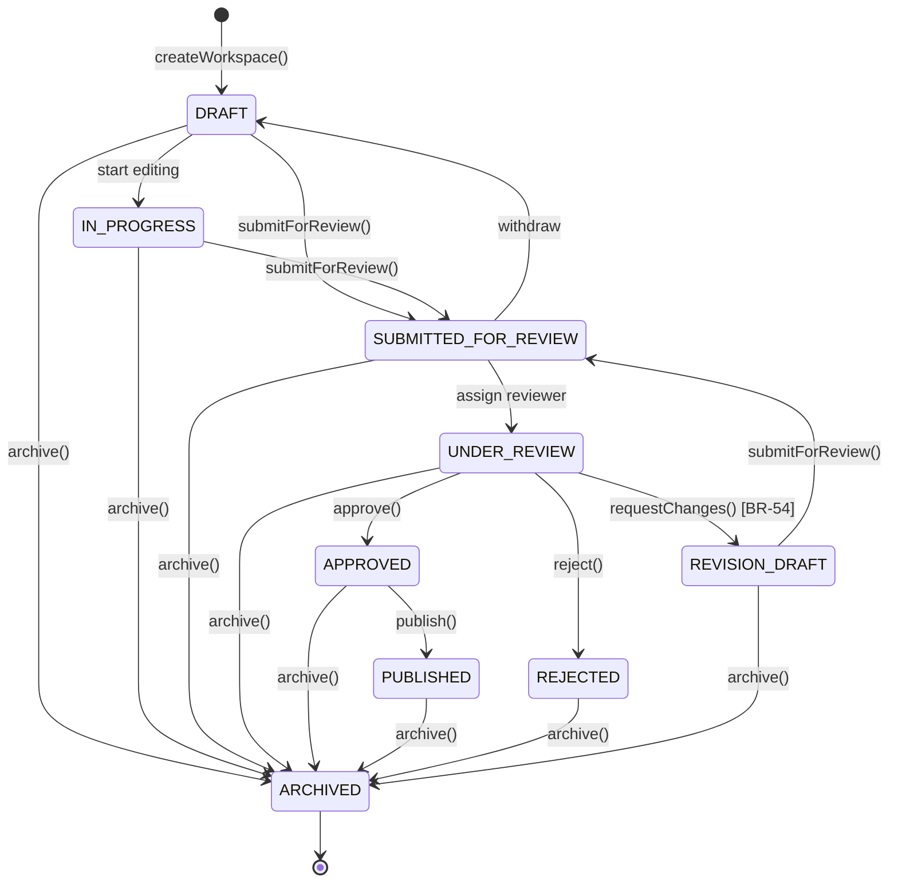

# Manuscript Editorial Workflow State Machine Diagram

## Overview

This document describes the state machine for the Manuscript Editorial Workflow, including all states and valid transitions as implemented in the codebase.

## States

| State | Description | Editable | Immutable |
|-------|-------------|----------|------------|
| DRAFT | Mangaka creating workspace | Yes | No |
| IN_PROGRESS | Mangaka actively editing | Yes | No |
| SUBMITTED_FOR_REVIEW | Submitted pending assignment | No | No |
| UNDER_REVIEW | Tantou reviewing (BR-2: only one per chapter) | No | No |
| APPROVED | Ready for publish (BR-4: immutable) | No | Yes |
| PUBLISHED | Published and live | No | Yes |
| REJECTED | Requires revision (BR-3: immutable) | No | Yes |
| REVISION_DRAFT | Revision in progress after CHANGES_REQUESTED (BR-54) | Yes | No |
| ARCHIVED | Historical record | No | Yes |

## State Transitions

### From DRAFT
- **DRAFT → IN_PROGRESS**: Mangaka starts editing
- **DRAFT → SUBMITTED_FOR_REVIEW**: Mangaka submits for review
- **DRAFT → ARCHIVED**: Workspace archived

### From IN_PROGRESS
- **IN_PROGRESS → SUBMITTED_FOR_REVIEW**: Mangaka submits for review
- **IN_PROGRESS → ARCHIVED**: Workspace archived

### From SUBMITTED_FOR_REVIEW
- **SUBMITTED_FOR_REVIEW → UNDER_REVIEW**: Tantou assigned to review
- **SUBMITTED_FOR_REVIEW → DRAFT**: Withdrawn before review
- **SUBMITTED_FOR_REVIEW → ARCHIVED**: Workspace archived

### From UNDER_REVIEW
- **UNDER_REVIEW → APPROVED**: Tantou approves manuscript
- **UNDER_REVIEW → REJECTED**: Tantou rejects manuscript
- **UNDER_REVIEW → REVISION_DRAFT**: Tantou requests changes (BR-54)
- **UNDER_REVIEW → ARCHIVED**: Workspace archived

### From APPROVED
- **APPROVED → PUBLISHED**: Manuscript published
- **APPROVED → ARCHIVED**: Manuscript archived

### From PUBLISHED
- **PUBLISHED → ARCHIVED**: Manuscript archived

### From REJECTED
- **REJECTED → ARCHIVED**: Manuscript archived (use createNewVersion for revision)

### From REVISION_DRAFT
- **REVISION_DRAFT → SUBMITTED_FOR_REVIEW**: Mangaka resubmits after revisions
- **REVISION_DRAFT → ARCHIVED**: Workspace archived

### From ARCHIVED
- **ARCHIVED**: Final state, no transitions allowed

## State Machine Diagram (Mermaid)

## Business Rule Mapping

| Business Rule | State Machine Enforcement |
|---------------|---------------------------|
| BR-47: Workspace Identity | Enforced in createWorkspace() - idempotent creation |
| BR-48: Versioning | Enforced in createNewVersion() - previousVersionId chain |
| BR-49: Annotation System | Enforced in AnnotationServiceV2 - coordinate anchoring |
| BR-50: Review Decisions | Enforced in approve(), reject(), requestChanges() |
| BR-51: ReviewTask Domain | Created on submitForReview() - tracks versionId, reviewerId, assignedAt, dueAt, reviewStatus |
| BR-52: SLA Tracking | Enforced in ReviewTaskService - 48h deadline, 36h warning, overdue state |
| BR-53: Immutable Versions | Enforced in ManuscriptVersion - APPROVED, PUBLISHED, REJECTED, ARCHIVED are immutable |
| BR-54: CHANGES_REQUESTED | New decision type with mandatory feedback, transitions to REVISION_DRAFT |
| BR-55: Publishing | Enforced in publish() - only APPROVED can transition to PUBLISHED |

## Implementation Notes

- State transitions are validated in `ManuscriptVersion.validateTransition()`
- Editable states: DRAFT, IN_PROGRESS, REVISION_DRAFT
- Immutable states: APPROVED, PUBLISHED, REJECTED, ARCHIVED
- Review states: SUBMITTED_FOR_REVIEW, UNDER_REVIEW
- REVISION_DRAFT is a new state added to support the CHANGES_REQUESTED workflow (BR-54)
- ReviewTask is automatically created when manuscript transitions to UNDER_REVIEW
- SLA monitoring runs hourly to check for overdue tasks and warning thresholds
